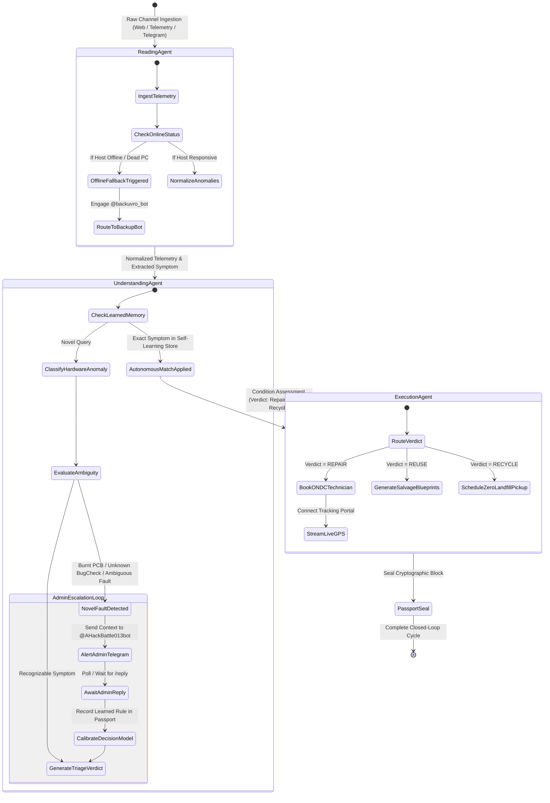
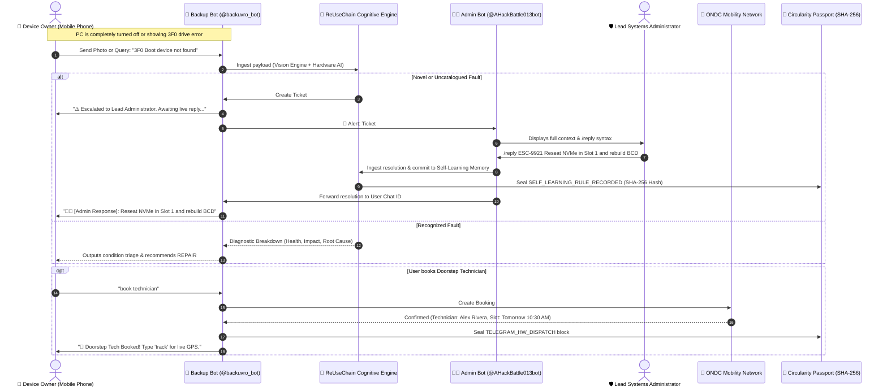
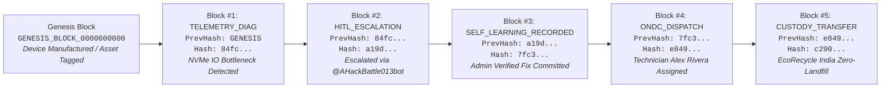

# ReUseChain: System Architecture & Knowledge Graph

This document provides the complete, authoritative topology of the **ReUseChain Multi-Agent Closed-Loop Circularity System**, mapping all hardware sensors, cognitive AI engines, decentralized protocols (ONDC), dual Telegram bot networks, and cryptographic ledgers.

---

## 🌐 1. High-Level Distributed Topology Graph

```mermaid
flowchart TB
    subgraph LAYER1["📡 Layer 1: Telemetry & Ingestion (Architecture 1: Reading)"]
        WMI["Win32 Telemetry Collector<br/><code>scripts/Collect-WindowsTelemetry.ps1</code>"]
        DAEMON["Desktop Daemon Agent<br/><code>scripts/ReUseChain-DesktopAgent.ps1</code>"]
        WEBCHAT["Web Action Chat Console<br/><code>src/app/assistant/page.tsx</code>"]
        BACKUPBOT["Mobile Emergency Bot<br/><code>@backuvro_bot (8923070582)</code><br/><i>Offline PC / Drive Error Fallback</i>"]
    end

    subgraph LAYER2["🧠 Layer 2: AI Diagnostics & Learning (Architecture 2: Understanding)"]
        VISION["Optical Vision Engine<br/><code>src/lib/vision-diagnostic-engine.ts</code><br/><i>Task Manager OCR & Blue Screen Analyzer</i>"]
        HW_AI["Cognitive Hardware AI<br/><code>src/lib/hardware-ai-agent.ts</code><br/><i>14 Direct & Functional Diagnostic Tools</i>"]
        SELF_LEARN["Adaptive Self-Learning Store<br/><code>src/lib/self-learning-agent.ts</code><br/><i>Permanent Rule Calibration</i>"]
        ADMINBOT["Admin Escalation Hub<br/><code>@AHackBattle013bot (8978711876)</code><br/><i>Indirect Support via /reply</i>"]
        LANGGRAPH["LangGraph Orchestrator<br/><code>src/lib/langgraph/workflow.ts</code><br/><i>Multi-Agent StateGraph</i>"]
    end

    subgraph LAYER3["⚡ Layer 3: Execution & Circularity (Architecture 3: Execution)"]
        ONDC["ONDC Doorstep Repair Dispatch<br/><code>/api/ondc/services</code><br/><i>Dell/HP Certified Technician Alex Rivera</i>"]
        GPS["Live ONDC GPS Telemetry<br/><code>src/app/track/[id]/page.tsx</code><br/><i>Vehicle #BLR-42 Real-Time Movement</i>"]
        REUSE["Modular Salvage Blueprints<br/><code>src/app/api/assistant/route.ts</code><br/><i>NAS / Plex Server (34.8 kg CO2e Avoided)</i>"]
        RECYCLE["R2 Zero-Landfill Recycler<br/><code>src/app/api/assistant/route.ts</code><br/><i>EcoRecycle India ($18.50 Scrap Credit)</i>"]
    end

    subgraph LAYER4["🔐 Layer 4: Trust & Ledger"]
        PASSPORT["Circularity Passport Blockchain<br/><code>src/app/passport/[id]/page.tsx</code><br/><i>Cryptographic SHA-256 Event Chain</i>"]
        SQLITE["Prisma SQLite dev.db<br/><code>prisma/schema.prisma</code><br/><i>Relational Fleet, Component & Session Data</i>"]
    end

    %% Layer 1 -> Layer 2 Connections
    WMI -->|WMI Telemetry JSON| HW_AI
    DAEMON -->|Thermal/Load Triggers| HW_AI
    WEBCHAT -->|Task Manager Screenshot| VISION
    WEBCHAT -->|User Natural Language| HW_AI
    BACKUPBOT -->|Photo of Screen Error| VISION
    BACKUPBOT -->|Offline PC / Drive Failure Query| HW_AI

    %% Layer 2 Internal Loops
    VISION -->|Detected Anomaly / PID| HW_AI
    HW_AI <-->|Rule Match / Query| SELF_LEARN
    HW_AI -->|Novel / Ambiguous Fault| ADMINBOT
    ADMINBOT -->|/reply Verified Rule| SELF_LEARN
    ADMINBOT -->|Direct Reply| BACKUPBOT
    ADMINBOT -->|Live Sync| WEBCHAT
    LANGGRAPH -.->|Coordinates| HW_AI

    %% Layer 2 -> Layer 3 Circular Dispatches
    HW_AI -->|Verdict: REPAIR| ONDC
    HW_AI -->|Verdict: REUSE| REUSE
    HW_AI -->|Verdict: RECYCLE| RECYCLE
    ONDC -->|Dispatched Order ID| GPS

    %% Layer 3 & Layer 2 -> Layer 4 Trust & Ledger
    ONDC -->|TELEGRAM_HW_DISPATCH| PASSPORT
    REUSE -->|REUSE_BLUEPRINT| PASSPORT
    RECYCLE -->|EWASTE_PICKUP| PASSPORT
    SELF_LEARN -->|SELF_LEARNING_RULE_RECORDED| PASSPORT
    PASSPORT -->|Store Event Blocks| SQLITE
    ONDC -->|Save OndcBooking| SQLITE
    ADMINBOT -->|Update AdminEscalation| SQLITE
```

---

## 🔄 2. Three-Architecture Multi-Agent LangGraph State Machine

---

## 📱 3. Dual Telegram Bot Event Flow Sequence

---

## 🔐 4. Circularity Passport Blockchain Proof Chain

Every hardware event, doorstep repair dispatch, e-waste recycling run, and self-learning rule is cryptographically committed as an immutable block in the **Circularity Passport**:

---

## 🗂️ 5. Component & Source File Mapping Table

| Node ID | Node Name | Architecture Layer | Source Implementation |
| :--- | :--- | :--- | :--- |
| `windows-collector` | Windows Telemetry Collector | Layer 1: Reading | [Collect-WindowsTelemetry.ps1](file:///c:/Users/banks/ReUseChain/scripts/Collect-WindowsTelemetry.ps1) |
| `desktop-daemon` | ReUseChain Desktop Daemon | Layer 1: Reading | [ReUseChain-DesktopAgent.ps1](file:///c:/Users/banks/ReUseChain/scripts/ReUseChain-DesktopAgent.ps1) |
| `web-action-chat` | Conversational Action Console | Layer 1: Reading | [src/app/assistant/page.tsx](file:///c:/Users/banks/ReUseChain/src/app/assistant/page.tsx) |
| `backup-telegram-bot` | Mobile Emergency Bot (@backuvro_bot) | Layer 1: Reading | [scripts/run-telegram-bots.ts](file:///c:/Users/banks/ReUseChain/scripts/run-telegram-bots.ts) |
| `vision-diagnostic-engine` | Optical Vision & Task Manager Analyzer | Layer 2: Understanding | [src/lib/vision-diagnostic-engine.ts](file:///c:/Users/banks/ReUseChain/src/lib/vision-diagnostic-engine.ts) |
| `cognitive-hardware-ai` | Cognitive Hardware Diagnostic AI | Layer 2: Understanding | [src/lib/hardware-ai-agent.ts](file:///c:/Users/banks/ReUseChain/src/lib/hardware-ai-agent.ts) |
| `self-learning-store` | Adaptive Self-Learning Memory | Layer 2: Understanding | [src/lib/self-learning-agent.ts](file:///c:/Users/banks/ReUseChain/src/lib/self-learning-agent.ts) |
| `admin-escalation-hub` | Admin Escalation Bot (@AHackBattle013bot) | Layer 2: Understanding | [src/lib/telegram-service.ts](file:///c:/Users/banks/ReUseChain/src/lib/telegram-service.ts) |
| `langgraph-orchestrator` | Multi-Agent LangGraph StateMachine | Layer 2: Understanding | [src/lib/langgraph/workflow.ts](file:///c:/Users/banks/ReUseChain/src/lib/langgraph/workflow.ts) |
| `ondc-doorstep-repair` | ONDC Doorstep Repair Dispatch | Layer 3: Execution | [src/app/api/ondc/services/route.ts](file:///c:/Users/banks/ReUseChain/src/app/api/ondc/services/route.ts) |
| `live-gps-tracking` | Live ONDC GPS Telemetry Tracker | Layer 3: Execution | [src/app/track/[id]/page.tsx](file:///c:/Users/banks/ReUseChain/src/app/track/[id]/page.tsx) |
| `modular-reuse-engine` | Modular Salvage & Reuse Engine | Layer 3: Execution | [src/app/api/assistant/route.ts](file:///c:/Users/banks/ReUseChain/src/app/api/assistant/route.ts) |
| `r2-certified-recycle` | R2v3 Certified Zero-Landfill Recycler | Layer 3: Execution | [src/app/api/assistant/route.ts](file:///c:/Users/banks/ReUseChain/src/app/api/assistant/route.ts) |
| `circularity-passport` | Circularity Passport Blockchain | Layer 4: Trust & Ledger | [src/app/passport/[id]/page.tsx](file:///c:/Users/banks/ReUseChain/src/app/passport/[id]/page.tsx) |
| `sqlite-prisma-orm` | Prisma Relational Database (dev.db) | Layer 4: Trust & Ledger | [prisma/schema.prisma](file:///c:/Users/banks/ReUseChain/prisma/schema.prisma) |
| `graph-visualizer` | Interactive Architecture Graph Page | UI Visualizer | [src/app/graph/page.tsx](file:///c:/Users/banks/ReUseChain/src/app/graph/page.tsx) |
