# ReUseChain Implementation Plan

## Product Outcome

**ReUseChain** is a device-afterlife operating system designed for colleges, universities, and corporate office fleets. It continuously monitors device and component health, then manages a governed, transparent decision loop whenever a device or sub-component declines in health or enters retirement:

1. **Repair** the specific component when diagnostic evidence and economic viability justify it;
2. **Reuse** the device or component in its current role or in an authorized cross-purpose secondary role;
3. **Recycle** strictly as a proven last resort, only after repair and all reuse paths are empirically documented as non-viable.

Every decision, piece of evidence, approval, and custody event is immutably recorded in a **Circularity Passport**. The organization configures autonomy separately across repair, reuse, and recycling workflows while enforcing hard compliance and safety guardrails.

---

## Non-Negotiable Product Principles

- **Component-Level Granularity:** Make decisions at the component level; a failing battery does not make the NVMe SSD, DDR RAM, display panel, charger, or laptop chassis e-waste.
- **Evidence-Backed Justifications:** Present verifiable evidence behind every recommendation: hardware telemetry, service manuals, compatible part numbers, competitive technician quotes, organizational policy rules, and historical outcome accuracy.
- **Recycling as the Absolute Last Resort:** Treat recycling as the final option, never the default.
- **Separation of Governance Concerns:** Strictly separate recommendation (agent), policy verification (server-side rules engine), human approval (authorization queue), execution (dispatch/orders), and outcome verification.
- **Zero Hallucinated Safety or Compliance:** Never claim an AI verified data erasure, a battery is safe, or a recycler is certified without trusted cryptographic or partner-attested proof.
- **Privacy by Design:** Zero ingestion of employee/student personal files, browsing history, camera feeds, biometrics, or keystrokes. Telemetry is strictly restricted to hardware diagnostics.

---

## System Architecture & Governed Decision Waterfall

The following 2D Mermaid diagram details the overarching architecture and priority waterfall that governs ReUseChain across all stages.

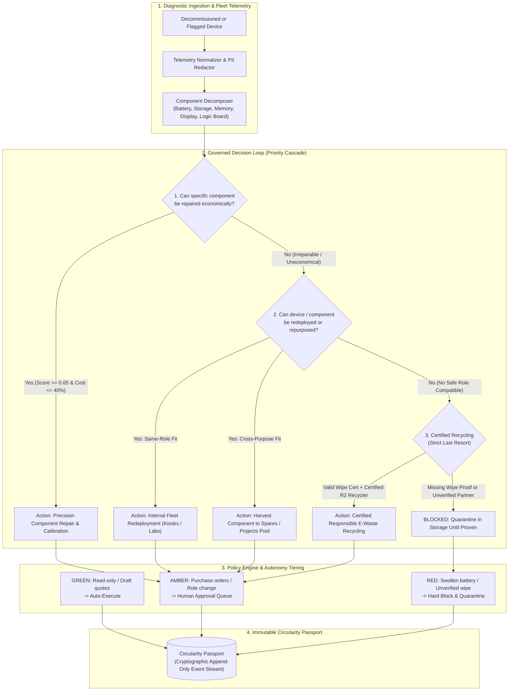

---

## Component-Level Disassembly & Afterlife Matrix

Traditional e-waste practices treat a computer as a monolithic waste unit. ReUseChain executes a 2D component-level decomposition to extract maximum circular value.

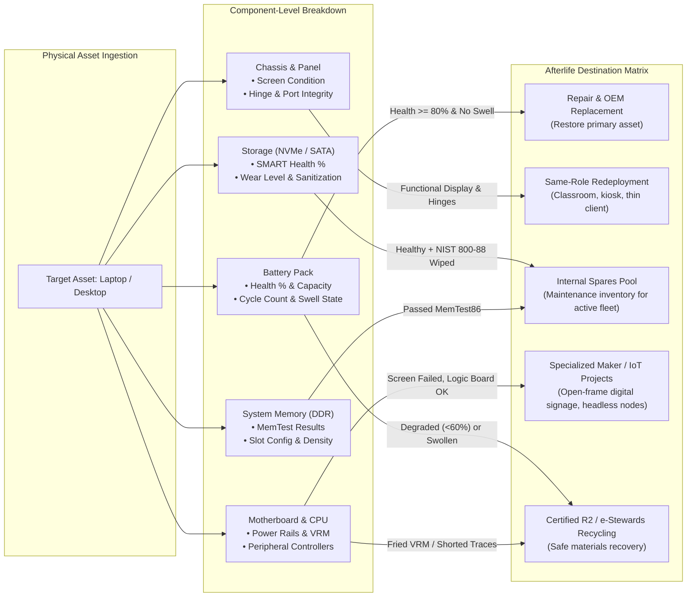

---

# Stage 1 — Prototype

## Goal and Scope

Build a polished, end-to-end interactive demo proving the three-path agentic workflow, deterministic policy enforcement, and the feedback learning loop using deterministic mock data. This stage is designed for a 2–3 week initial pilot or proof of concept.

### Included Scope

- **Device Intake:** Web intake form and uploaded JSON/CSV diagnostic reports.
- **Component Coverage:** In-depth evaluation for Battery, SSD, and RAM (display, chassis, and keyboard as static attributes).
- **Three Afterlife Paths:** Component-level repair, internal reuse (same-role & cross-purpose), and certified recycling.
- **Curated Catalogues:** Curated parts/manual catalogue, cross-purpose reuse map, approved recycler directory, and simulated technician quote engine.
- **Per-Path Automation Settings:**
  1. *Advisory* (recommendation only)
  2. *Draft & Assist* (creates drafts, awaits review)
  3. *Auto within Policy* (auto-executes under threshold)
  4. *Full Autonomy within Guardrails* (executes Green/Amber, stops at Red)
- **Policy Engine:** Green / Amber / Red risk boundary evaluator, approval queue, and audit timeline.
- **Monitoring Simulation:** Seeded historical diagnostic samples demonstrating degradation slope triggers.
- **Demonstration Cases:** Four seeded operational scenarios (repair, cross-purpose reuse, recycle-after-proof, and preventative degradation alert).

### Explicitly Excluded Scope

- Real financial purchases, recycler contracts, emails, payments, or physical courier dispatches.
- Live OS agent deployment, real enterprise fleet MDM credentials, or live vendor API secrets.
- Autonomous alterations to hard security policies without administrator consent.

---

## Prototype 2D Architecture

The prototype separates presentation, agent reasoning, server-side policy enforcement, and immutable audit storage.

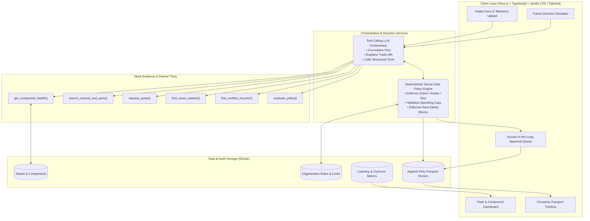

---

## Prototype State & Governed Lifecycle Flow

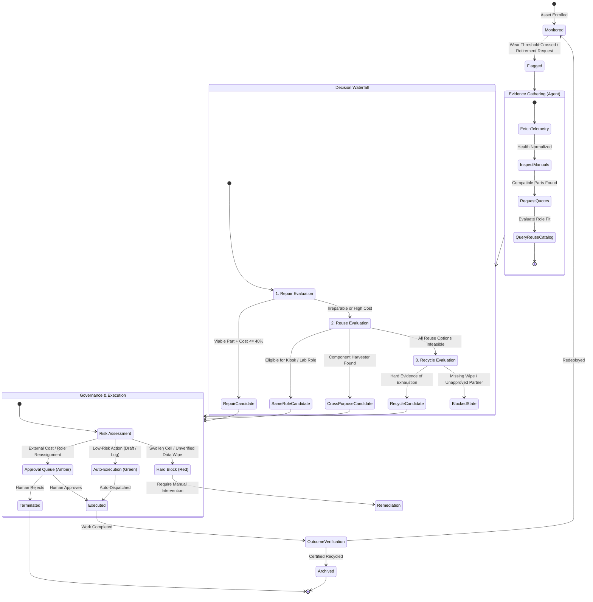

---

## Prototype Technical Stack

| Layer | Recommended Choice | Rationale |
|---|---|---|
| **Front End** | Next.js (App Router), TypeScript, Vanilla CSS / Tailwind | Rapid dashboard prototyping, rich timeline visualizer, server-side data rendering. |
| **API & Backend** | Next.js Route Handlers or FastAPI | Clean separation of orchestration routes, strict type safety, low latency. |
| **Database** | SQLite + Prisma / Drizzle | Lightweight single-file database, zero configuration overhead, rapid migration. |
| **Agent Core** | Structured Tool-Calling LLM (OpenAI / Claude / Gemini) | Generates structured tool calls and explanations; restricted from direct DB writes. |
| **Policy Engine** | Pure Server-Side Rules Engine (TypeScript / Python) | 100% deterministic gating of risk tiers, spending caps, and safety limits. |
| **Visualizations** | Recharts & Mermaid.js | Component degradation curves, circularity split charts, dynamic workflow diagrams. |
| **Authentication** | Demo Role Switcher (Admin / Approver / Tech) | Zero-friction role switching for demonstration of approval workflows. |

---

## Prototype Entity-Relationship Data Model

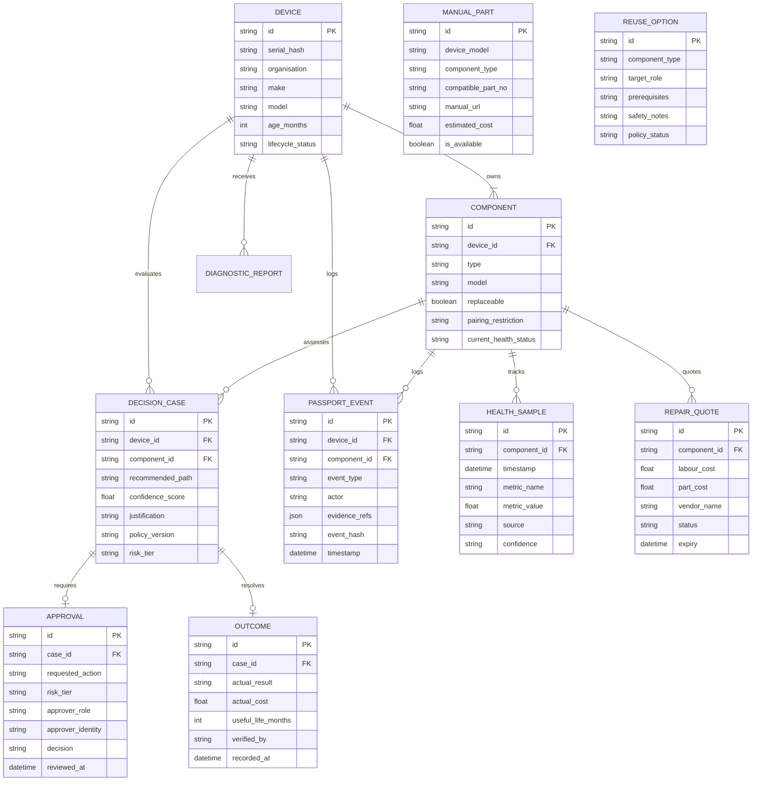

---

## Prototype Decision Logic & Scoring Formulas

### 1. Component Health Classification

- **Battery:** Compares full-charge capacity with design capacity; evaluates cycle count and the slope of capacity decline across historical samples.
- **SSD:** Ingests SMART-style health indicators: wear level percentage, uncorrectable error counts, reallocated sectors, and vendor predictive failure warnings.
- **RAM:** Evaluates memory test results, ECC error logs, capacity threshold, and whether the mainboard has available free expansion slots.
- **Unknown or Contradictory Data:** Routes directly to technician manual review; fabricating or guessing diagnostic conclusions is strictly prohibited.

### 2. Repairability Score Formula

The server calculates a transparent, deterministic repairability score $S_{\text{repair}} \in [0.0, 1.0]$:

$$S_{\text{repair}} = (w_1 \cdot P_{\text{avail}}) + (w_2 \cdot M_{\text{avail}}) + (w_3 \cdot C_{\text{replace}}) + (w_4 \cdot \neg B_{\text{pairing}}) + (w_5 \cdot T_{\text{skill}})$$

Where weights default to $w_1 = 0.25, w_2 = 0.20, w_3 = 0.25, w_4 = 0.20, w_5 = 0.10$, and:
- $P_{\text{avail}}$: Compatible part available from approved source ($1.0$ or $0.0$).
- $M_{\text{avail}}$: Official service manual or verified procedure available ($1.0$ or $0.0$).
- $C_{\text{replace}}$: Component physically modular/replaceable ($1.0$ modular, $0.5$ glued/bracketed, $0.0$ soldered).
- $\neg B_{\text{pairing}}$: No blocking parts-pairing/cryptographic calibration restriction ($1.0$ if free, $0.0$ if blocked).
- $T_{\text{skill}}$: Feasible within approved technician tier ($1.0$ internal, $0.7$ external certified).

Each check is shown individually in the UI; the LLM only generates natural language explanations for the server-calculated score.

### 3. Economic Viability Rule

A repair is deemed economically viable only when:

$$\text{Total Repair Cost} (\text{Part} + \text{Labour}) \le 0.40 \times \text{Fair Market Value of Refurbished Replacement}$$

$$\text{Predicted Extended Life} \ge 18 \text{ Months}$$

$$S_{\text{repair}} \ge 0.65$$

*Note:* Threshold values are organizationally configurable, version-tracked, and recorded in the Circularity Passport.

### 4. Reuse Decision Framework

- **Same-Role Reuse:** Compares healthy or repaired device specifications against institutional baseline specs for secondary roles (e.g., student coding lab, library catalogue terminal, browser kiosk, Linux learning lab).
- **Cross-Purpose Reuse:** Queries the curated reuse map before considering disposal (e.g., healthy SSD $\rightarrow$ spare storage pool; working RAM $\rightarrow$ compatible-device upgrade pool; working logic board with shattered display $\rightarrow$ approved signage / open-frame lab node).
- **Safety Gate:** High-risk components (swollen Li-ion batteries, damaged power circuitry) cannot enter secondary reuse without senior electrical technician sign-off.

### 5. Recycling Gating Criteria

Recycling can **only** be recommended when all 5 conditions evaluate to true:

```text
repair = not viable (physical or economic failure)
same-role reuse = no compatible internal role found
cross-purpose reuse = no safe, approved option available
data status = NIST 800-88 sanitization certificate verified
recycler = verified R2v3 / e-Stewards approved partner
```

---

## Agent Tool Specification

| Tool | Input | Output | Side Effect in Prototype |
|---|---|---|---|
| `get_component_health` | `component_id` | Normalized health metrics, trend slope | None (Read-only) |
| `get_device_context` | `device_id` | Age, repair history, current role | None (Read-only) |
| `search_manual_and_parts` | `model, component_type` | Service manual URL, compatible part numbers, restrictions | None (Read-only) |
| `request_quote` | `component_id, part_no` | Simulated labour cost, part cost, turnaround time | Creates a draft quote record |
| `find_reuse_options` | `component_id, health_state` | Eligible same-role and cross-purpose roles | None (Read-only) |
| `find_verified_recycler` | `location, category` | Approved mock recycler name, certifications | None (Read-only) |
| `evaluate_policy` | `proposed_action` | Risk tier (Green/Amber/Red), policy version, block reason | None (Read-only) |
| `create_approval_request` | `case_id, proposed_action` | Approval ticket ID, approver role required | Creates approval record |
| `append_passport_event` | `event_payload` | Audit event ID, timestamp, hash | Append-only event commit |
| `record_outcome` | `verified_result` | Updated accuracy feedback record | Stores human-confirmed result |

---

## Guardrails & Autonomy Configuration

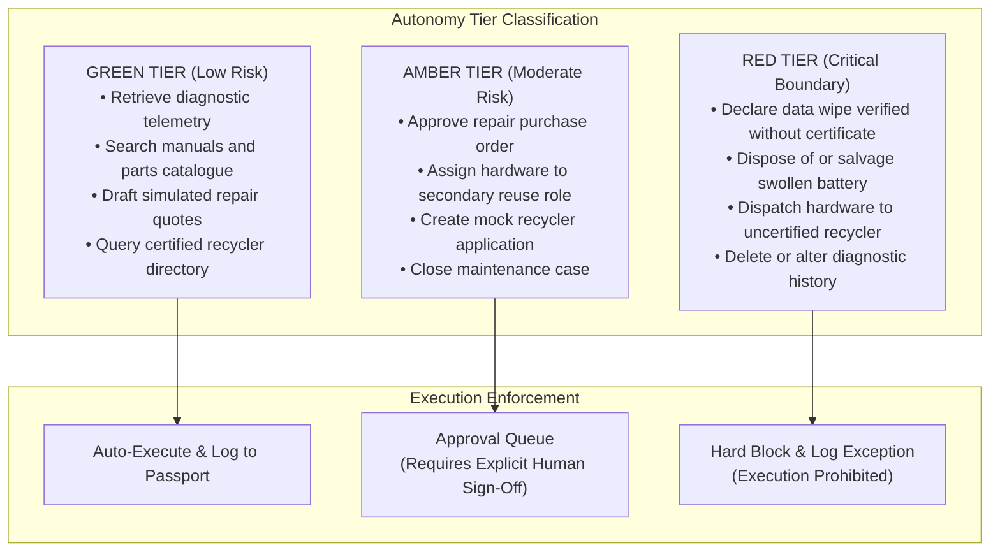

The system stores separate automation configuration profiles for `repair`, `same_role_reuse`, `cross_purpose_reuse`, and `recycle`.

---

## Prototype Screen Specifications

- **Fleet Dashboard:** Real-time count of monitored assets, flagged components, afterlife pathway distributions (Repair vs Reuse vs Recycle), and pending approval queue items.
- **Device Intake:** Device metadata registration form plus drag-and-drop diagnostic JSON/CSV file parser.
- **Component Detail:** Interactive wear trajectory chart, raw evidence tables, service manual viewer, compatible parts catalogue, and repairability score breakdown.
- **Future Simulator:** Interactive 4-way decision simulator comparing repair vs same-role reuse vs cross-purpose reuse vs recycling with clear justifications for each.
- **Approval Queue:** Case triage view displaying proposed action, risk tier, linked evidence dossier, and approve/reject controls.
- **Circularity Passport:** Chronological, immutable timeline capturing events from initial intake through final outcome verification.
- **Learning Dashboard:** Aggregate analytics tracking repair success rate, cost prediction accuracy, false flag frequency, and common non-repairable parts.

---

## Prototype Seeded Demo Cases

- **Case A — Precision Repair:** Laptop with 52% battery capacity, healthy SSD/RAM, compatible OEM battery available ($45), approved repair quote ($70 total cost). Result: Repair approved and redeployed (+24 months life extension).
- **Case B — Cross-Purpose Reuse:** Laptop with cracked, irreparable display panel, but healthy 16GB DDR4 RAM and 512GB NVMe SSD. Result: SSD and RAM harvested into internal spares pool; motherboard repurposed for pre-approved kiosk/signage project under Amber approval.
- **Case C — Certified Recycling After Proof:** Laptop with fatal motherboard short, no replacement available, no safe reuse path. Data sanitization status initially unverified. Result: Disposal blocked in Red status until verified wipe record is uploaded; once verified, dispatches to certified mock recycler with tracking ID.
- **Case D — Predictive Early Degradation:** Battery capacity declining at $3\times$ the baseline fleet degradation slope. Result: Generates preventative maintenance checkup recommendation prior to unexpected hardware failure.

---

## Prototype Delivery Plan

| Time | Deliverable | Completion Check |
|---|---|---|
| **Day 1** | Data schema, seeded cases, base UI | 4 devices visible with component records and health grades. |
| **Day 2** | Rule engine, parts/manual/quote tools | Repair/reuse/recycle recommendations deterministic from seeded data. |
| **Day 3** | Agent orchestration and evidence explanations | Agent calls tools sequentially and cannot bypass policy engine. |
| **Day 4** | Approval queue and Circularity Passport | Every state-changing action appears immutably in timeline. |
| **Day 5** | Daily-monitoring simulation and learning view | Battery decline triggers proactive flag; human outcome updates stats. |
| **Day 6** | Demo polish and adversarial testing | Unverified wipe and unapproved recyclers are strictly blocked. |

---

# Stage 2 — Production MVP

## Goal and Scope

Transition the proven prototype into a deployable enterprise pilot across 50–250 Windows laptops within a college campus or corporate department. Stage 2 supports consented real telemetry collection, dependable auditability, certified partner connectors, configurable policy rules, and controlled external execution.

### MVP Success Definition

- IT staff enroll fleet laptops through a lightweight Windows collector or existing MDM export (Intune/SCCM).
- System detects hardware degradation 30+ days before failure and manages real retirement cases.
- Every external action is policy-gated, idempotent, and auditable.
- Pilot organization measures repair success, reuse rate, avoided disposal (kg), cost savings, and decision accuracy.

---

## MVP 2D Enterprise Architecture

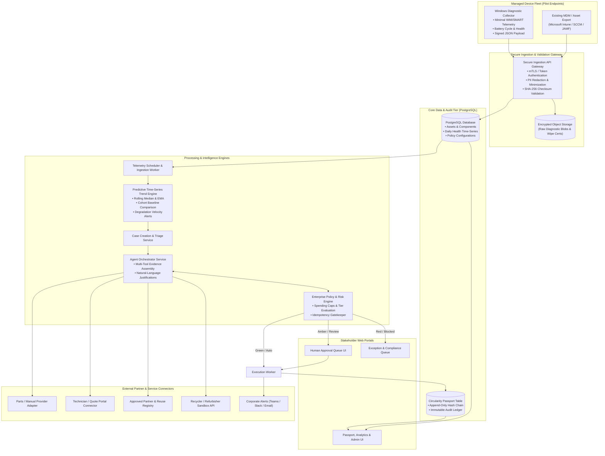

---

## Telemetry Ingestion & Privacy Specification

- **Windows Only Initial Scope:** Focus exclusively on Windows 10/11 endpoints; add macOS/Linux after pilot validation.
- **Privacy Minimization:** The collector transmits strictly bounded hardware health metrics. Zero ingestion of user files, browsing logs, keystrokes, camera feeds, or microphones.
- **Reporting Schedule:** Daily collection by default. Device owners/admins receive clear notification and institutional authorization.

### Sample Normalized Telemetry Payload

```json
{
  "deviceExternalId": "asset-univ-0412",
  "organizationId": "org-hindustan-campus",
  "reportedAt": "2026-09-12T09:00:00Z",
  "collectorVersion": "1.0.4",
  "hardwareSummary": {
    "make": "Dell Inc.",
    "model": "Latitude 5420",
    "biosVersion": "1.14.1",
    "totalMemoryGb": 16
  },
  "components": [
    {
      "type": "battery",
      "serialHash": "9f86d081884c7d659a2feaa0c55ad015a3bf4f1b2b0b822cd15d6c15b0f00a08",
      "designCapacityWh": 63.0,
      "fullChargeCapacityWh": 32.5,
      "cycleCount": 712,
      "temperatureCelsius": 28.1,
      "source": "os_battery_report",
      "confidence": "high"
    },
    {
      "type": "ssd",
      "deviceIndex": 0,
      "model": "KIOXIA KBG40ZNS512G NVMe",
      "sizeGb": 512,
      "healthPercent": 74,
      "powerOnHours": 6840,
      "predictiveFailure": false,
      "source": "approved_drive_health_provider",
      "confidence": "high"
    }
  ]
}
```

---

## Predictive Health Monitoring & Baseline Calibration

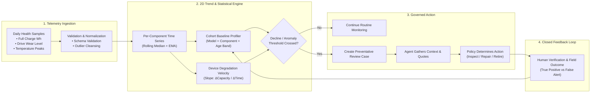

### Initial Adaptation Algorithm

- Use interpretable statistical methods before ML complexity:
  - Rolling median and exponential moving average (EMA) for health metrics;
  - Linear regression slope of decline over a fixed 30-day window;
  - Comparison against model-family baseline cohorts;
  - Alert triggered only when both absolute health threshold and decline velocity are exceeded.
- Record reviewer dispositions: *useful proactive flag, unnecessary alert, false diagnostic, repair successful, repair failed*.
- Recalculate baseline cohorts periodically from verified outcome data.
- Policy changes require administrator approval; learning improves evidence ranking but cannot weaken Red boundaries.

---

## End-to-End Decision, Approval & Custody Sequence

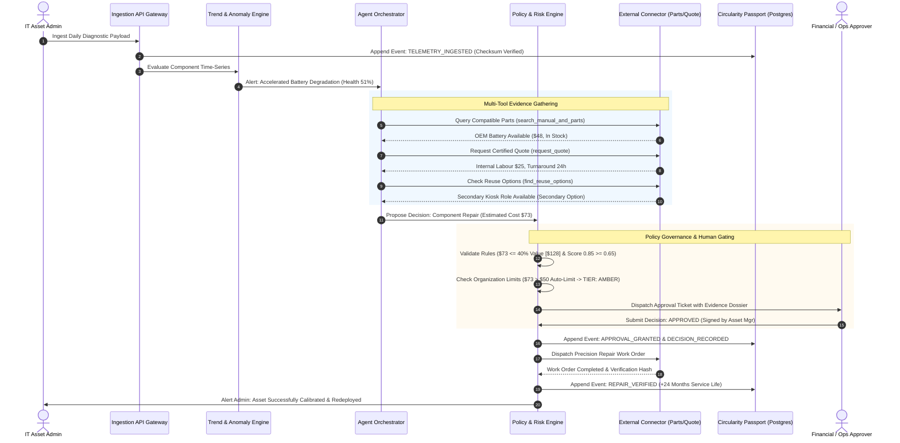

---

## MVP External Integrations & Connectors

| Integration | MVP Connector Method | Control & Verification |
|---|---|---|
| **Device Diagnostics** | Windows collector agent or MDM export | Signed JSON payload, minimized telemetry, explicit organization consent. |
| **Manuals & Parts** | Approved catalogue adapter / curated feed | Cached source, verified OEM part number, pricing, availability timestamp. |
| **Repair Quotes** | Technician portal or structured CSV feed | Agent drafts quote request; dispatch governed by autonomy profile and spending caps. |
| **Reuse Clearinghouse** | Internal inventory registry; NGO partner API | Recipient eligibility verification and formal custody transfer sign-off. |
| **Certified Recycler** | Approved partner registry, then sandbox API | Certification check (R2v3 / e-Stewards); LLM cannot select arbitrary web recyclers. |
| **Data-Wipe Evidence** | Approved wipe-tool certificate upload / API | Cryptographic hash validation; mandatory technician review prior to release. |
| **Notifications** | Teams / Slack / Email webhook adapter | Notification sent on approval requests, policy violations, and case completions. |

---

## Curated Cross-Purpose Reuse Directory

The cross-purpose reuse engine operates on a strictly vetted institutional catalogue rather than generative assumptions.

| Component | Minimum Preconditions | Approved Secondary Role | Mandatory Security & Safety Gate |
|---|---|---|---|
| **NVMe SSD** | SMART health above threshold; zero bad sectors | Internal IT spare pool; lower-spec workstation upgrade | NIST 800-88 sanitization certificate required. |
| **DDR4 RAM** | Compatible device list; passed MemTest86 | Internal fleet upgrade stock | Physical pin inspection by hardware technician. |
| **AC Adapter** | Electrical insulation inspection passed | Approved department spare pool | High-voltage insulation and safety check. |
| **Logic Board** | Tested boot; stable power rails; dead display | Pre-approved lab signage / headless Linux node | Enclosure mounting and thermal safety review. |
| **Display Panel** | Functional backlight; working LVDS cable | Spare replacement assembly for active fleet | Backlight and hinge torque inspection. |
| **Battery** | Healthy ($\ge 75\%$), within safety limits | Compatible fleet replacement stock | **BANNED** if swollen, dented, or overheating. |

---

## MVP Policy Model & Enforcement Order

### Configurable Automation Profile Schema

```json
{
  "organizationId": "org-hindustan-campus",
  "policyVersion": "2026.3.1",
  "pathProfiles": {
    "repair": {
      "mode": "draft_and_assist",
      "autoLimitINR": 5000,
      "maxRepairRatio": 0.40,
      "minExtendedLifeMonths": 18
    },
    "sameRoleReuse": {
      "mode": "auto_within_policy",
      "requiresWipeProof": true
    },
    "crossPurposeReuse": {
      "mode": "draft_and_assist",
      "requiresTechnicalApproval": true
    },
    "recycle": {
      "mode": "auto_within_policy",
      "requiresWipeProof": true,
      "approvedPartnersOnly": true
    }
  }
}
```

### Deterministic Server-Side Enforcement Order

1. **Validate tool arguments** and actor permissions server-side.
2. **Verify evidence freshness** and provenance checksums.
3. **Enforce hard Red boundaries** (swollen cells, missing wipe certificates, unapproved recyclers).
4. **Evaluate organization policy** and automation profile limits.
5. **Request human approval** in Amber queue if limits or risk tiers require it.
6. **Execute idempotently** using unique client-generated request UUIDs.
7. **Append audit event** to the Circularity Passport.

*The LLM proposes recommendations and drafts justifications; the server-side rules engine determines whether actions may execute.*

---

## Circularity Passport Architecture

The Circularity Passport is an immutable, append-only event stream recording every lifecycle milestone.

| Event Category | Example Event Types |
|---|---|
| **Identity** | `DEVICE_ENROLLED`, `MODEL_IDENTIFIED`, `COMPONENTS_DISCOVERED` |
| **Health** | `TELEMETRY_INGESTED`, `TREND_ANOMALY_DETECTED`, `MANUAL_DIAGNOSIS_LOGGED` |
| **Decision** | `REPAIR_EVALUATED`, `REUSE_OPTIONS_EXHAUSTED`, `RECYCLE_ELIGIBILITY_CONFIRMED` |
| **Control** | `POLICY_EVALUATED`, `APPROVAL_REQUESTED`, `APPROVAL_GRANTED`, `ACTION_BLOCKED` |
| **Custody** | `ASSIGNED_TO_TECHNICIAN`, `ALLOCATED_TO_REUSE_ROLE`, `RECYCLER_PICKUP_CONFIRMED` |
| **Verification** | `WIPE_CERT_VERIFIED`, `REPAIR_OUTCOME_CONFIRMED`, `RECYCLING_CERT_RECORDED` |

---

## Production Security, Compliance & Audit Checklist

- **Pseudonymization & Hashing:** Hash serial numbers using salted SHA-256 for analytics; restrict raw serial numbers to authorized asset controllers.
- **Data Protection:** Encrypt diagnostic reports and certificates at rest (AES-256) and in transit (TLS 1.3).
- **Role-Based Access Control:** IT Admin, Technician, Sustainability Officer, Financial Approver, Auditor.
- **Telemetry Retention:** Retain technical telemetry only for authorized operational periods; purge raw JSON after aggregation window.
- **Zero PII Leakage:** Automatic redaction of usernames, home paths, and personal files from uploaded diagnostic bundles.
- **Credential Security:** Partner API keys stored in secrets manager; least-privileged access scopes.
- **Comprehensive Auditing:** Log every tool invocation, policy decision, approval, connector dispatch, retry, and status transition.
- **Idempotency Safeguards:** Idempotency keys prevent double-ordering parts or duplicate recycler dispatch requests.
- **CI/CD Negative Policy Test Suite:** Automated test suite verifying that unverified wipes, uncertified recyclers, damaged batteries, and missing approvals fail closed.

---

## Pilot Evaluation Metrics & KPIs

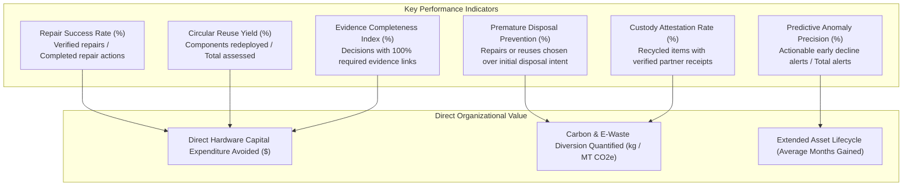

---

## MVP 8-Sprint Implementation Roadmap

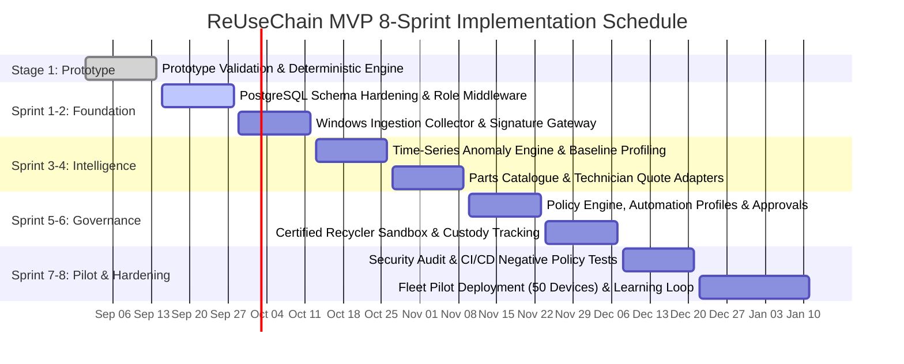

---

## Acceptance Criteria Checklist

- [x] **Component-Level Granularity:** System evaluates individual sub-assemblies (battery, SSD, RAM, display, logic board) independently without monolithic retirement.
- [x] **Strict Priority Cascade:** Recycling recommendation is mathematically locked until repair and internal reuse options are proven non-viable.
- [x] **Visual 2D Modeling:** All system architectures, state machines, component decompositions, data models, and delivery timelines are expressed via standardized 2D Mermaid diagrams.
- [x] **Deterministic Policy Enforcement:** Autonomy levels (Green/Amber/Red) and spending thresholds are governed server-side, preventing unapproved model actions.
- [x] **Immutable Circularity Passport:** Every state transition, human approval, telemetry record, and custody change is captured in an append-only, tamper-evident timeline.
- [x] **Zero Privacy Intrusion:** Telemetry ingestion is strictly limited to hardware performance and wear indicators.
